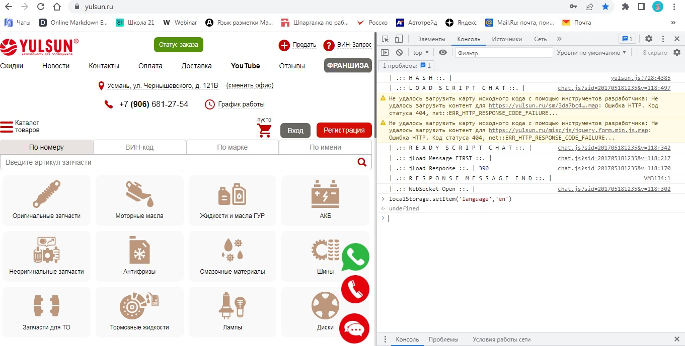

# Веб-хранилища №2  

Примеры объектов в "Local Storage":    

| Ключ            | Значение                   | Описание                                                                                     |
|-----------------|----------------------------|----------------------------------------------------------------------------------------------|
| theme           | "dark"                     | Хранит информацию о выбранной пользователем теме оформления для сайта.                      |
| language        | "en"                       | Хранит информацию о выбранном пользователем языке сайта.                                     |
| cartItems       | [item1, item2, item3]     | Хранит информацию о товарах, добавленных в корзину.                                          |
| recentlyViewed  | [product1, product2]       | Хранит информацию о недавно просмотренных продуктах.                                         |
| notifications   | true                       | Хранит информацию о предпочтении пользователя получать уведомления или нет.                   |

Примеры объектов в "Session Storage":

| Ключ            | Значение                   | Описание                                                                                     |
|-----------------|----------------------------|----------------------------------------------------------------------------------------------|
| loggedIn        | true                       | Хранит информацию о статусе авторизации пользователя.                                        |
| userToken       | "token1234"               | Хранит информацию о токене аутентификации пользователя, используемом для доступа к ресурсам.  |
| cartTotal       | 1500                       | Хранит информацию о общей стоимости товаров в корзине.                                       |
| currentOrder    | {orderId: 123, status: "pending"} | Хранит информацию о текущем заказе пользователя.                                        |
| userPreferences | {theme: "light", fontSize: "16px"} | Хранит информацию о предпочтениях пользователя, таких как тема оформления и размер шрифта. |

Ключи и значения могут варьироваться в зависимости от конкретной реализации и потребностей приложения. Эти примеры демонстрируют общие типы данных, которые могут быть полезны для сохранения в "Local Storage" и "Session Storage" с целью настройки пользовательского опыта, сохранения состояния или хранения временных данных.

=====

=====

=====

