# SQL

База данных 1: Customers

Запрос 1: 
```sql
SELECT * FROM Customers WHERE Country = 'Germany'
```
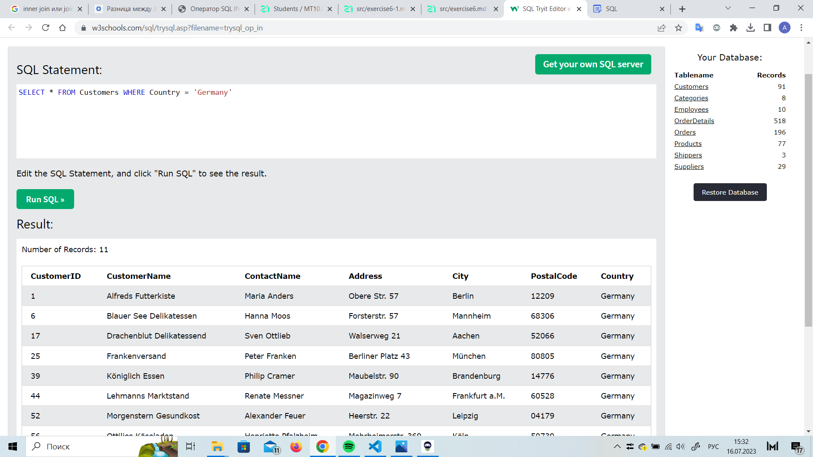
Описание: Этот запрос извлекает всех клиентов из Германии из базы данных Customers. В результате будут получены данные о клиентах, такие как их идентификаторы, имена, контактные данные и т.д.

Запрос 2: 
```sql
SELECT CustomerName, City, Country FROM Customers ORDER BY CustomerName ASC
```
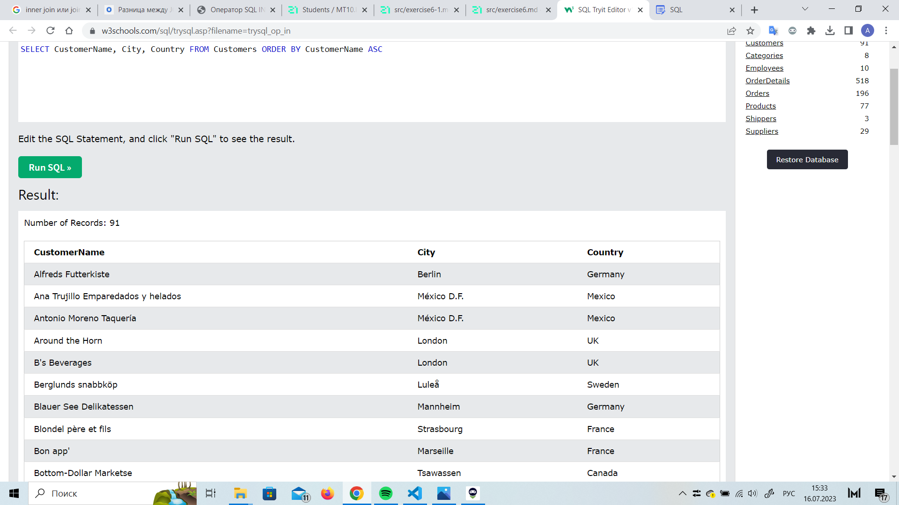
Описание: Данный запрос извлекает имена клиентов, города и страны клиентов из базы данных Customers. Результаты сортируются в алфавитном порядке по имени клиента.

Запрос 3 (сложный):
```sql
SELECT Orders.OrderID, Customers.CustomerName, Orders.OrderDate, OrderDetails.Quantity, Products.ProductName
FROM Customers
JOIN Orders ON Customers.CustomerID = Orders.CustomerID
JOIN OrderDetails ON Orders.OrderID = OrderDetails.OrderID
JOIN Products ON OrderDetails.ProductID = Products.ProductID
WHERE Customers.Country = 'USA' AND OrderDetails.Quantity > 10
```
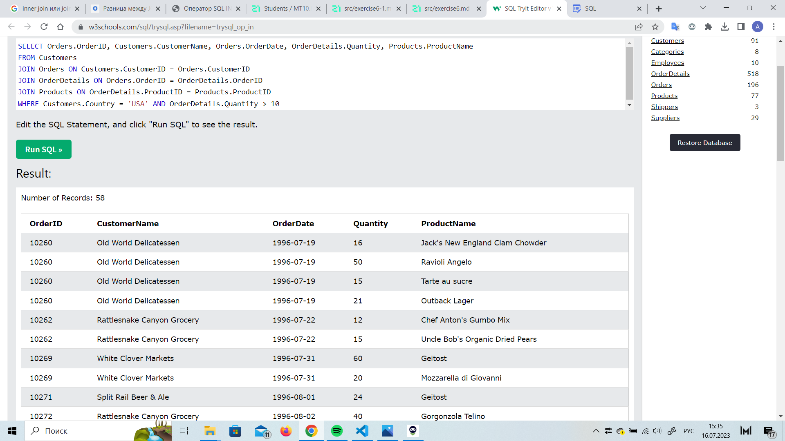
Описание: Этот сложный запрос соединяет несколько таблиц (Customers, Orders, OrderDetails и Products) для извлечения информации о заказах. Он возвращает идентификатор заказа, имя клиента, дату заказа, количество товара и название продукта для всех заказов, сделанных клиентами из США, где количество товара превышает 10.

База данных 2: Employees

Запрос 1: 
```sql
SELECT * FROM Employees WHERE EmployeeID = 1
```
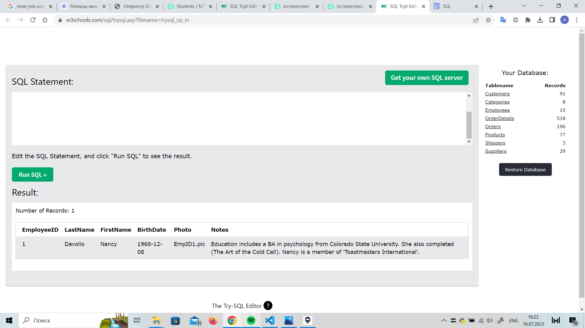
Описание: Этот запрос извлекает информацию о сотруднике с идентификатором 1 из базы данных Employees. Результаты запроса включают данные о сотруднике, такие как его идентификатор, имя, должность и т.д.

Запрос 2: 
```sql
SELECT FirstName, LastName, BirthDate FROM Employees ORDER BY BirthDate DESC
```
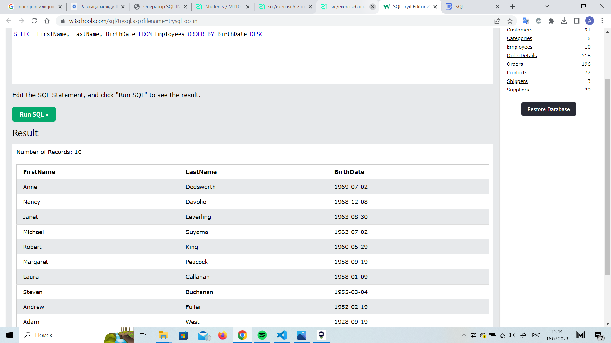
Описание: Данный запрос извлекает имена, фамилии и даты рождения сотрудников из базы данных Employees. Результаты сортируются в обратном хронологическом порядке.

Запрос 3 (сложный):
```sql
SELECT Employees.EmployeeID, Employees.FirstName, Employees.LastName, Orders.OrderID, Orders.OrderDate
FROM Employees
JOIN Orders ON Employees.EmployeeID = Orders.EmployeeID
WHERE Employees.EmployeeID IN (SELECT EmployeeID FROM Orders)
```
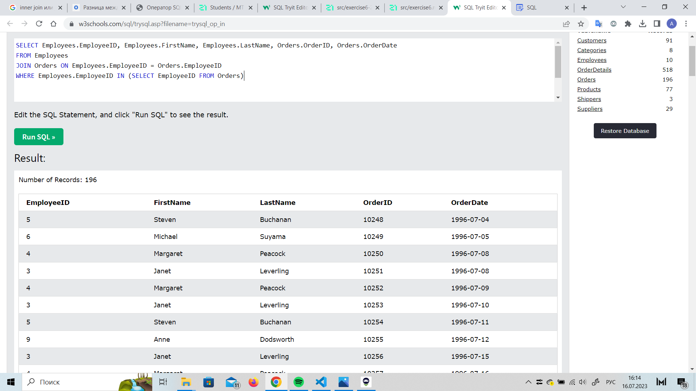
Описание: Этот сложный запрос соединяет таблицы Employees и Orders для извлечения информации о заказах, сделанных сотрудниками. Результаты запроса включают идентификаторы сотрудников, их имена, идентификаторы заказов и даты заказов.

База данных 3: Orders

Запрос 1: 
```sql
SELECT * FROM Orders WHERE OrderID = 10249
```
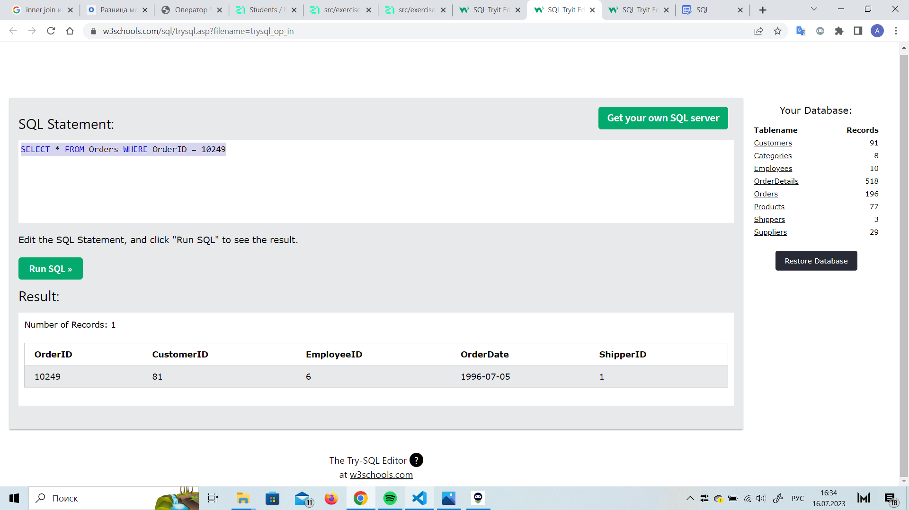
Описание: Этот запрос извлекает информацию о заказе с идентификатором 10249 из базы данных Orders. Результаты запроса включают данные о заказе, такие как его идентификатор, идентификатор клиента, дату заказа и т.д.

Запрос 2: 
```sql
SELECT CustomerID, OrderDate FROM Orders ORDER BY OrderDate DESC
```
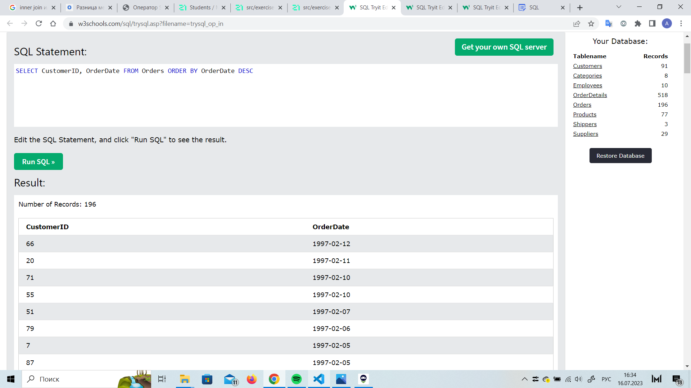
Описание: Данный запрос извлекает идентификатор клиента и дату заказа из базы данных Orders. Результаты сортируются в обратном хронологическом порядке по дате заказа.

Запрос 3 (сложный):
```sql
SELECT Customers.CustomerName, Orders.OrderID, Products.ProductName, OrderDetails.Quantity
FROM Customers
JOIN Orders ON Customers.CustomerID = Orders.CustomerID
JOIN OrderDetails ON Orders.OrderID = OrderDetails.OrderID
JOIN Products ON OrderDetails.ProductID = Products.ProductID
WHERE Customers.Country = 'Germany'
```
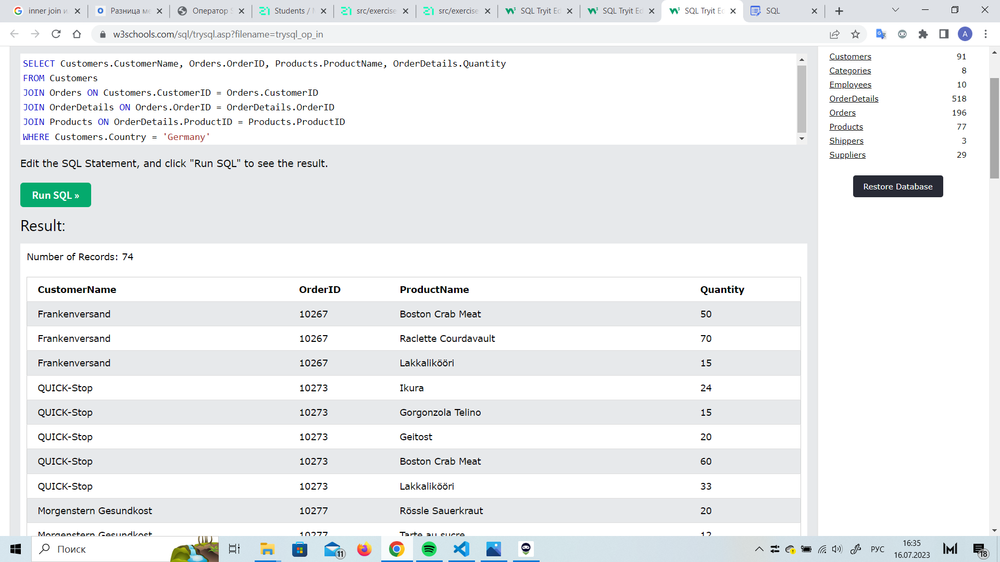
Описание: Этот сложный запрос соединяет таблицы Customers, Orders, OrderDetails и Products для извлечения информации о заказах. Он возвращает имена клиентов, идентификаторы заказов, названия продуктов и количество товара для всех заказов, сделанных клиентами из Германии.

База данных 4: Products

Запрос 1: 
```sql
SELECT * FROM Products WHERE CategoryID = 2
```
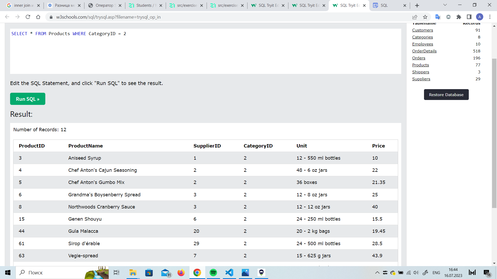
Описание: Этот запрос извлекает все продукты из категории с идентификатором 2 из базы данных Products. Результаты запроса включают информацию о продуктах, такую как их идентификаторы, названия и т.д.

Запрос 2: 
```sql
SELECT ProductName, Price FROM Products WHERE Price > 21 ORDER BY Price ASC
```
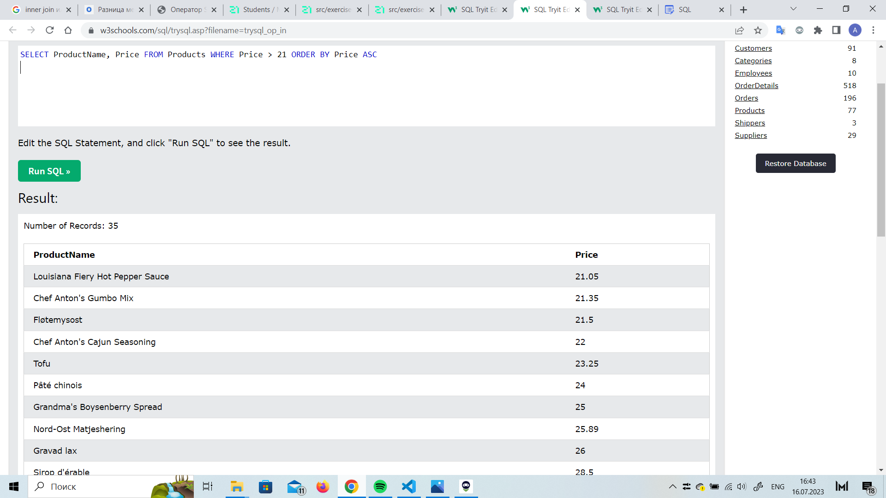
Описание: Данный запрос извлекает названия продуктов, у которых цена больше 21. Результаты сортируются по возрастанию цены.

Запрос 3 (сложный):
```sql
SELECT Categories.CategoryName, Products.ProductName
FROM Categories
JOIN Products ON Categories.CategoryID = Products.CategoryID
JOIN Suppliers ON Products.SupplierID = Suppliers.SupplierID
WHERE Categories.CategoryName = 'Beverages' AND Suppliers.Country = 'USA'
```
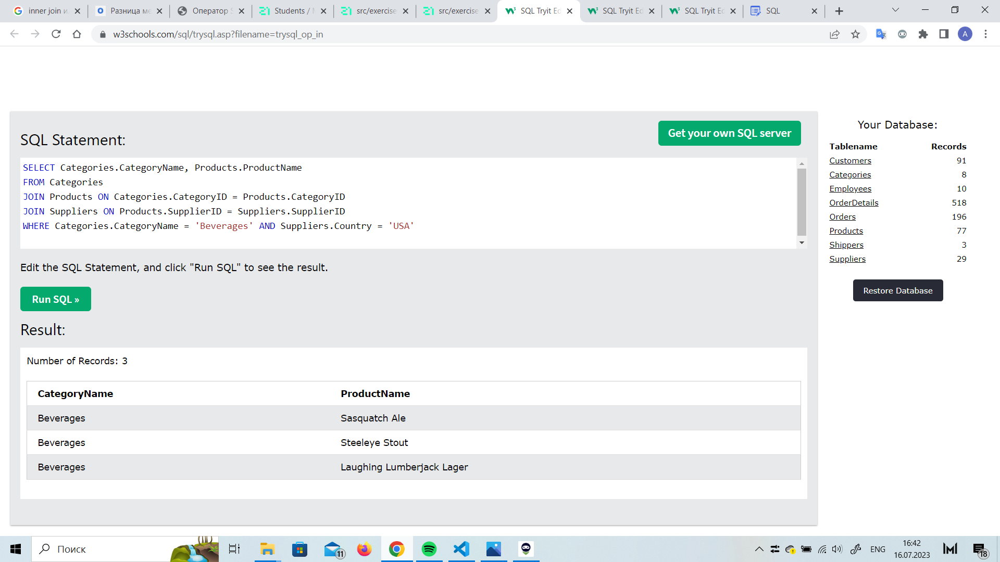
Описание: Этот сложный запрос соединяет таблицы Categories и Products для извлечения информации о продуктах. Он возвращает названия категорий, названия продуктов для всех продуктов из категории "Beverages", поставляемых из США.

База данных 5: Categories

Запрос 1: 
```sql
SELECT * FROM Categories WHERE CategoryName LIKE '%Condiments%'
```
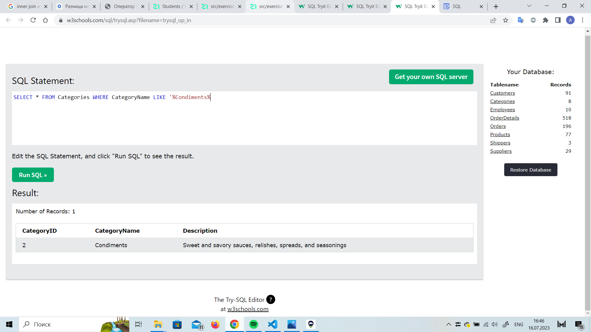
Описание: Этот запрос извлекает все категории, содержащие слово "Condiments" в названии, из базы данных Categories. Результаты запроса включают информацию о категориях, такую как их идентификаторы и названия.

Запрос 2: 
```sql
SELECT CategoryName, COUNT(*) AS ProductCount FROM Categories JOIN Products ON Categories.CategoryID = Products.CategoryID GROUP BY CategoryName
```
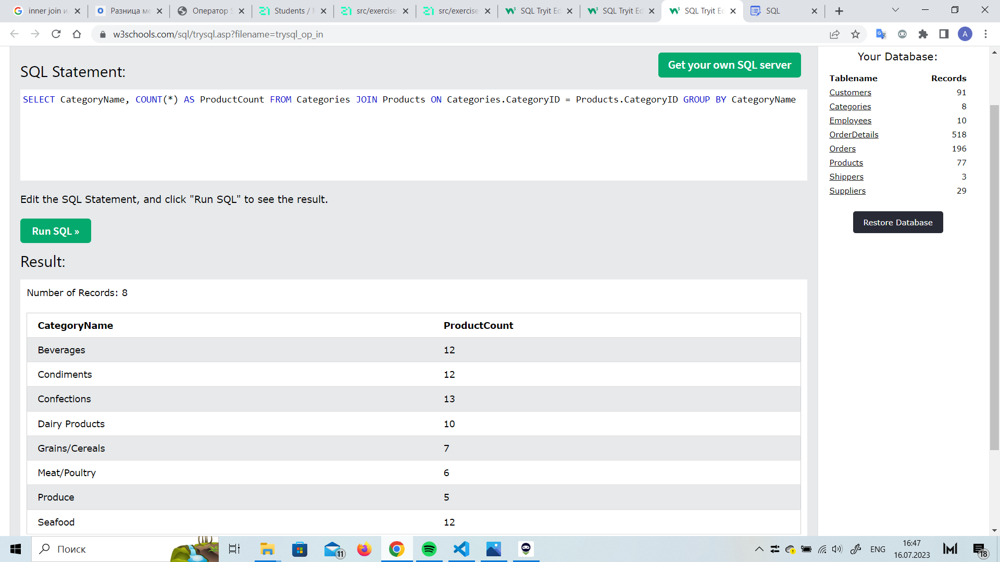
Описание: Данный запрос подсчитывает количество продуктов в каждой категории из базы данных Categories. Результаты запроса включают названия категорий и количество продуктов в каждой категории.

Запрос 3 (сложный):
```sql
SELECT Categories.CategoryName, Products.ProductName, Suppliers.SupplierName
FROM Categories
JOIN Products ON Categories.CategoryID = Products.CategoryID
JOIN Suppliers ON Products.SupplierID = Suppliers.SupplierID
WHERE Categories.CategoryName = 'Beverages' AND Suppliers.Country = 'USA'
```
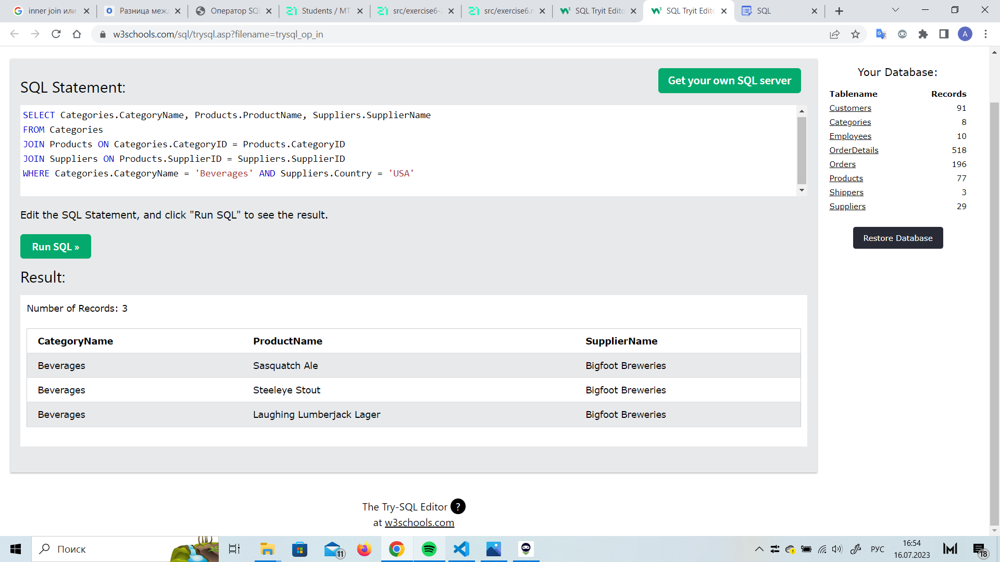
Описание: Этот сложный запрос соединяет таблицы Categories, Products и Suppliers для извлечения информации о напитках, поставляемых поставщиками из США. Результаты запроса включают названия категорий, названия продуктов и названия поставщиков.

База данных 6: Shippers

Запрос 1: 
```sql
SELECT * FROM Shippers ORDER BY ShipperName DESC
```
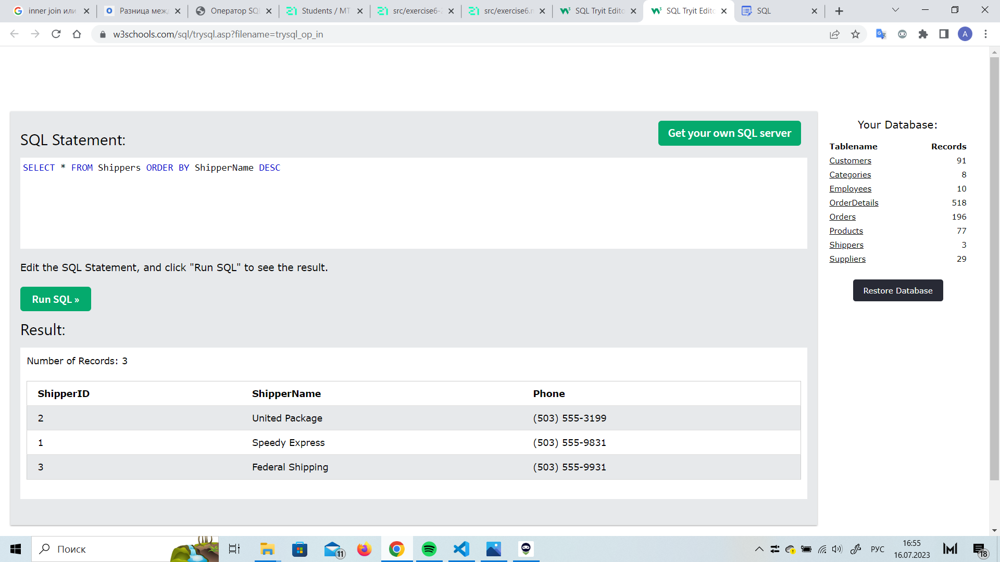
Описание: Этот запрос извлекает информацию о всех перевозчиках из базы данных Shippers. Результаты запроса сортируются в обратном алфавитном порядке по имени перевозчика.

Запрос 2: 
```sql
SELECT ShipperName, COUNT(*) AS OrderCount FROM Shippers JOIN Orders ON Shippers.ShipperID = Orders.ShipperID GROUP BY ShipperName
```
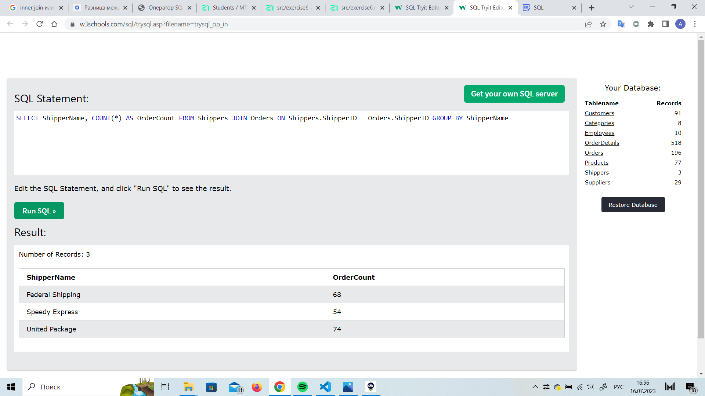
Описание: Данный запрос подсчитывает количество заказов, обработанных каждым перевозчиком из базы данных Shippers. Результаты запроса включают имена перевозчиков и количество заказов, обработанных каждым перевозчиком.

Запрос 3 (сложный):
```sql
SELECT Shippers.ShipperName, Orders.OrderID, Customers.CustomerName
FROM Shippers
JOIN Orders ON Shippers.ShipperID = Orders.ShipperID
JOIN Customers ON Orders.CustomerID = Customers.CustomerID
WHERE Shippers.ShipperName = 'Speedy Express' AND Customers.Country = 'USA'
```
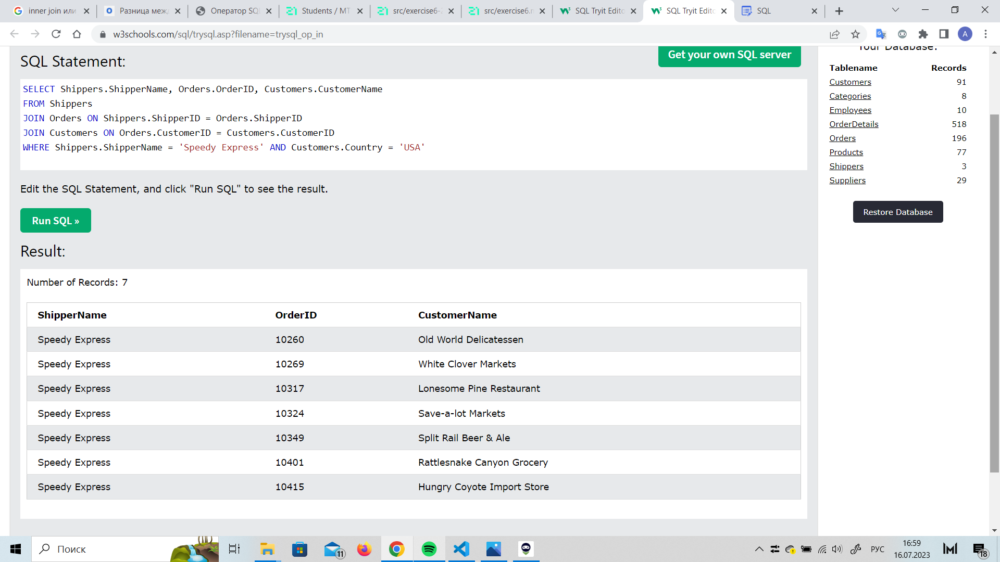
Описание: Этот сложный запрос соединяет таблицы Shippers, Orders и Customers для извлечения информации о заказах. Он возвращает имена перевозчиков, идентификаторы заказов и имена клиентов, обработанных перевозчиком "Speedy Express" и сделанных клиентами из США.

База данных 7: Suppliers

1. Запрос 1:
   ```sql
   SELECT * FROM Suppliers;
   ```
   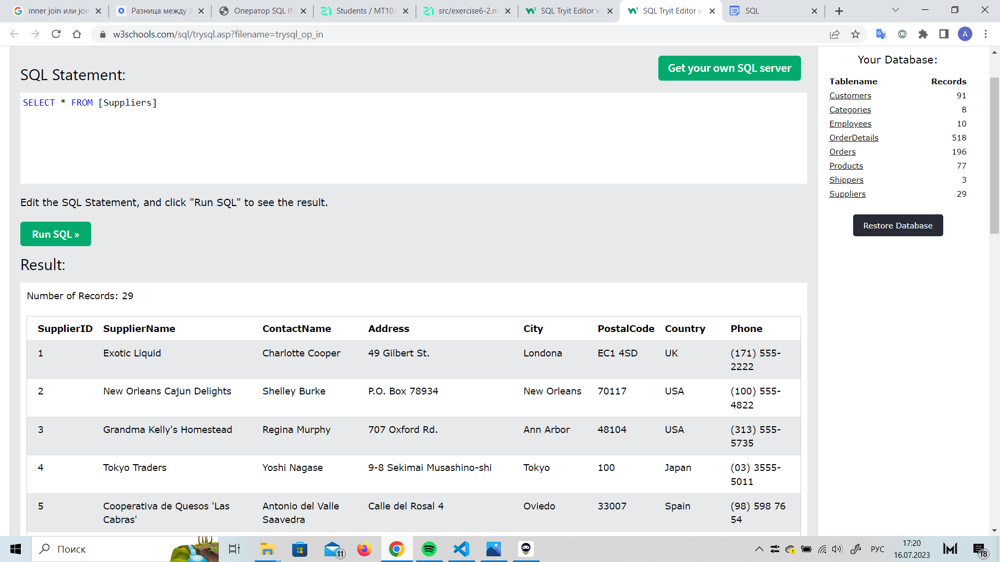
   Описание: Этот запрос извлекает все данные о поставщиках, включая их идентификаторы, названия, контактные данные и т.д.

2. Запрос 2:
   ```sql
   SELECT * FROM Suppliers WHERE Country = 'USA';
   ```
   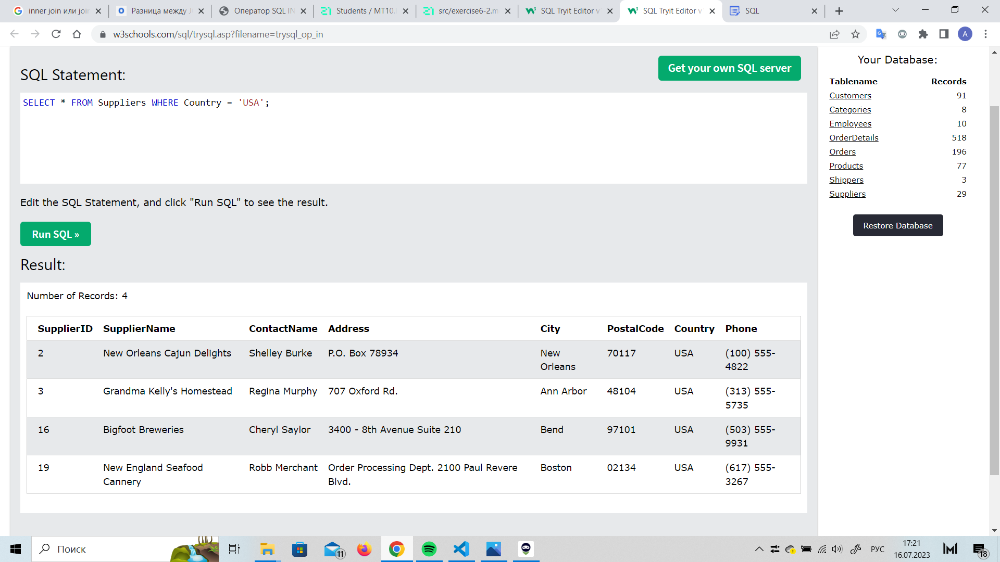
   Описание: Этот запрос извлекает данные о поставщиках из США. Возвращаются все связанные с ними детали, такие как идентификаторы, названия, адреса и контактные данные.

3. Запрос 3 (сложный):
   ```sql
   SELECT Suppliers.SupplierName, COUNT(OrderDetails.OrderID) AS TotalOrders
   FROM Suppliers
   INNER JOIN Products ON Suppliers.SupplierID = Products.SupplierID
   INNER JOIN OrderDetails ON Products.ProductID = OrderDetails.ProductID
   GROUP BY Suppliers.SupplierName
   ORDER BY TotalOrders DESC
   LIMIT 5;
   ```
   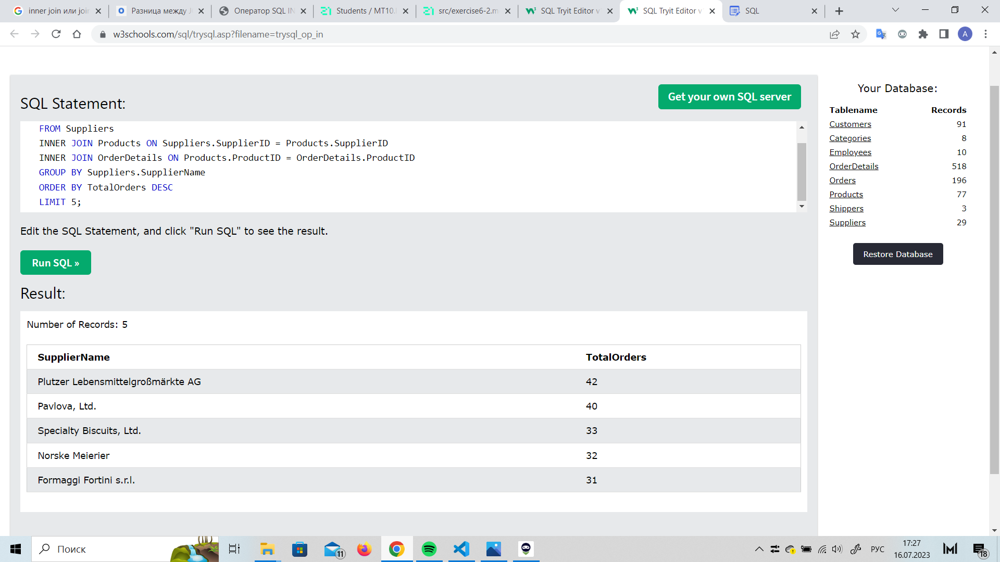
   Описание: Этот запрос объединяет таблицы Suppliers, Products и OrderDetails по идентификатору поставщика и продукта, и извлекает названия поставщиков и общее количество заказов для каждого поставщика. Результаты сортируются по убыванию общего количества заказов и ограничиваются первыми пятью поставщиками.

База данных 8: OrderDetails

1. Запрос 1:  
   ```sql
   SELECT * FROM OrderDetails;
   ```  
   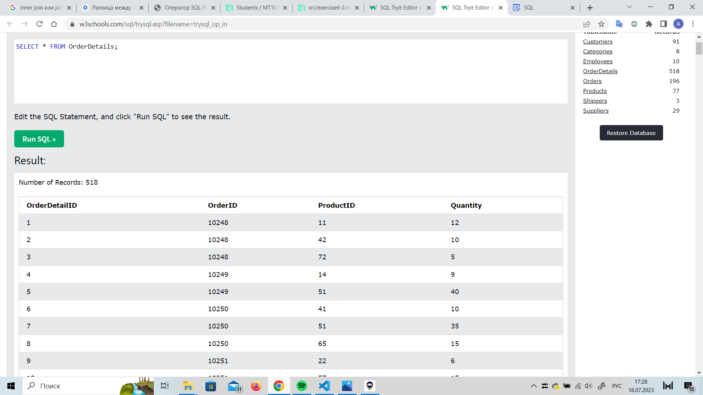
   Описание: Этот запрос извлекает все данные о деталях заказов, включая их идентификаторы заказов, идентификаторы продуктов, количество и цены.  

2. Запрос 2:  
   ```sql
   SELECT * FROM OrderDetails WHERE OrderID = 10255;
   ```  
   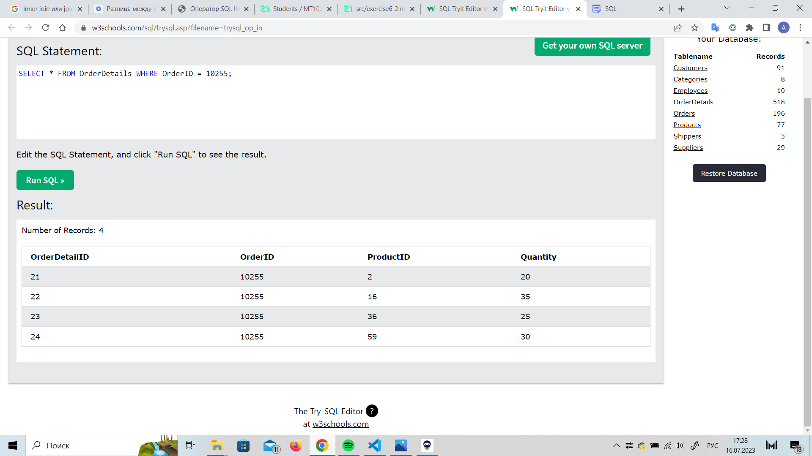
   Описание: Этот запрос извлекает данные о деталях заказа с идентификатором 10255. Возвращаются все связанные с ними детали, такие как идентификаторы заказов, идентификаторы продуктов, количество и цены.  

3. Запрос 3 (сложный):  
   ```sql
   SELECT Products.ProductName, SUM(OrderDetails.Quantity) AS TotalQuantity
   FROM OrderDetails
   INNER JOIN Products ON OrderDetails.ProductID = Products.ProductID
   GROUP BY Products.ProductName
   HAVING TotalQuantity > 100;
   ```  
   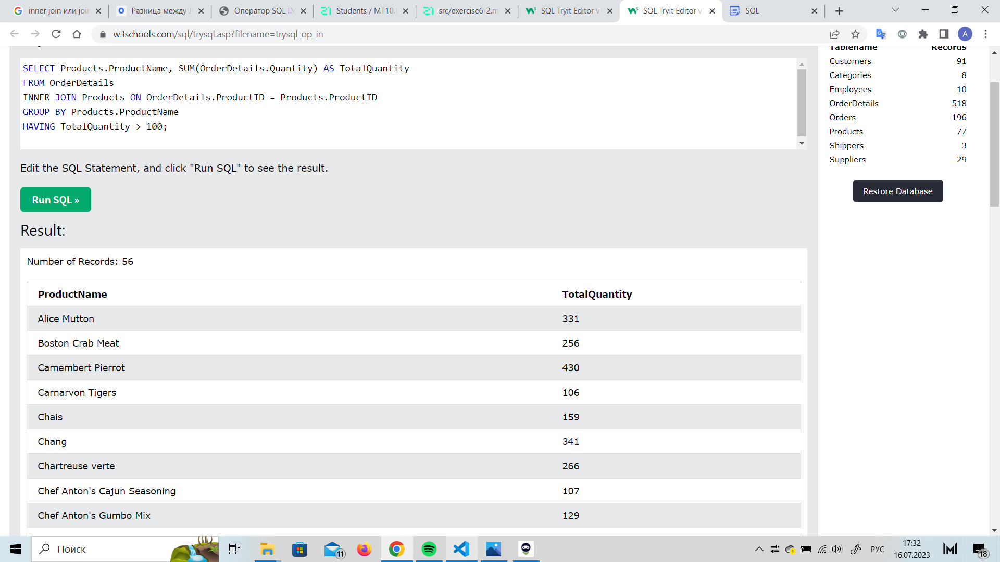
   Описание: Этот запрос объединяет таблицы OrderDetails и Products по идентификатору продукта и извлекает названия продуктов и общее количество продуктов для каждого продукта. Результаты группируются по названию продукта, а затем отфильтровываются только те продукты, у которых общее количество продуктов превышает 100.
